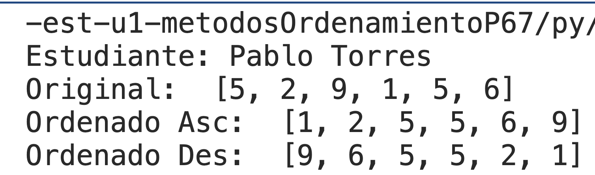
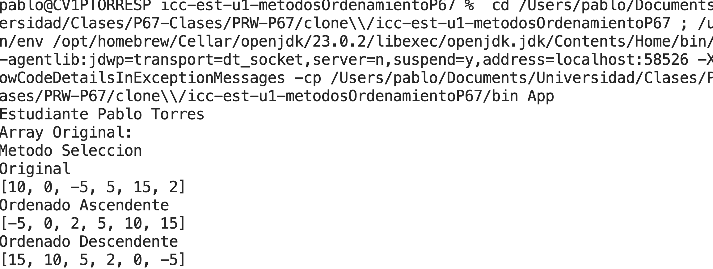

# Estructura de datos

**Estudiante:** Pablo Torres

## Metodos Ordenamiento

### Practica 1 - 20/OCT
Metodo Sort Bubble

### Practica 2 - 21/OCT
Metodo Sort Selecction en Java y Python

Salida de Python

Salidad de Java

